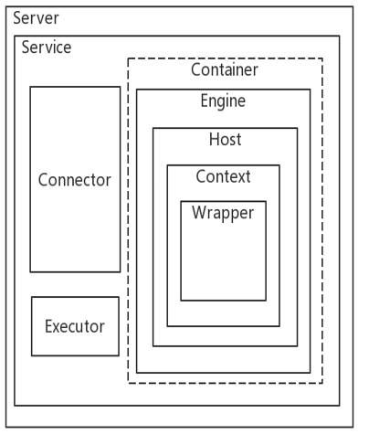

## Tomcat8.5.X源码分析

#### 源码分析主线


#### Tomcat组件

- 组件结构



- 组件描述

| 组件   | 说明  |
|------|-----|
|Server|整个Servlet容器，一个Server可以有多个Service|
|Service|一个Service维护多个Connector和一个Container|
|Connector|链接器：监听转换Socket请求，将请求交给Container处理，支持不同协议以及不同的I/O方式|
|Container|表示能够执行客户端请求并返回响应的一类对象，其中有不同级别的容器：Engine、Host、Context、Wrapper|
|Engine|整个Servler引擎，最高级的容器对象|
|Host|表示Servlet引擎中的虚拟机，主要与域名有关，一个服务器有多个域名是可以使用多个Host|
|Context|用于表示ServletContext,一个ServletContext表示一个独立的Web应用|
|Wrapper|用于表示Web应用中定义的Servlet|
|Executor|Tomcat组件间可以共享的线程池|

#### Tomcat请求链路


#### 源码目录结构

- org.apache.catalina
  <br>包含所有的Servlet容器实现，以及涉及到安全、会话、集群、部署管理Servlet容器的各个方面，同时还包含的启动入口。
- org.apache.coyote
  <br>是Tomcat连接器框架的名称，Tomcat服务器提供的客户端访问外部接口，客户端通过Coyote于服务器建立连接、发送请求并接受响应。
- org.apache.el
  <br> 提供java表达式语言支持。
- org.apache.jasper
  <br>提供JSP引擎支持。
- naming
  <br>提供JNDI服务。
- tomcat
  <br>提供外部调用的API。

#### Tomcat工程启动VM参数

```properties
-Dcatalina.home=catalina-home
-Dcatalina.base=catalina-home
-Djava.endorsed.dirs=catalina-home/endorsed
-Djava.io.tmpdir=catalina-home/temp
-Djava.util.logging.manager=org.apache.juli.ClassLoaderLogManager
-Djava.util.logging.config.file=catalina-home/conf/logging.properties
```

#### 系列博文

- [Tomcat - 如何设计一个简单的web容器](/ethen/docs/Tomcat-如何设计一个简单的web容器.md)
- [Tomcat - 理解Tomcat架构设计](/ethen/docs/Tomcat-理解Tomcat架构设计.md)
- [Tomcat - 源码分析准备和分析入口](/ethen/docs/Tomcat-源码分析准备和分析入口.md)
- [Tomcat - 启动过程：初始化和启动流程](/ethen/docs/Tomcat-启动过程：初始化和启动流程.md)
- [Tomcat - 启动过程:类加载机制详解](/ethen/docs/Tomcat-启动过程类加载机制详解.md)
- [Tomcat - Request请求处理过程：Connector](https://pdai.tech/md/framework/tomcat/tomcat-x-connector.html)

#### 参考资源
